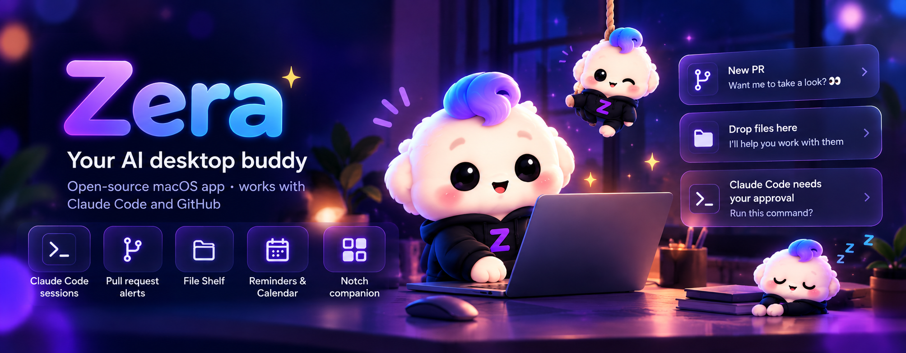
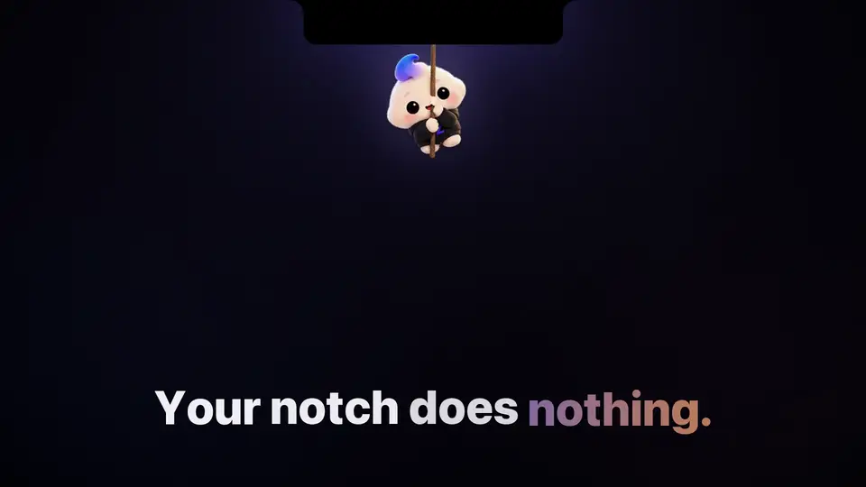

<p align="center"></p>

<h1 align="center">Zera</h1>
<p align="center"><b>Your AI buddy in the notch.</b> A free, open-source macOS app that lives in your notch: your Mac's vitals, your Claude Code sessions, fresh downloads, tasks and timesheets, and your day. <a href="https://zera.pravincodes.in/">zera.pravincodes.in</a></p>

<p align="center">
  <a href="https://github.com/amsynist/zera/releases/latest"></a>
  <a href="https://github.com/amsynist/zera/actions/workflows/ci.yml"></a>
  
</p>

<p align="center">
  <a href="site/assets/zera-film.mp4"></a><br>
  <sub>▶ <a href="site/assets/zera-film.mp4">Watch the 40-second film</a> (with sound)</sub>
</p>

## What's new

- **A buddy with personality:** Zera follows your cursor with live eyes, blinks, breathes and reacts to hover and taps. Four quick taps earn a playful huff.
- **Water breaks · Splash:** a glass pops up beside your cursor and Zera jumps from the notch into it with a splash. Answer **Drank** or **10 min**, and she jumps back up. After each sip a small glass under the notch shows today's count, and your week makes a shareable card. [Try the interactive preview](https://zera.pravincodes.in/#water).

- **Your Mac at a glance:** a vitals strip on Home (CPU, memory, GPU, Wi-Fi, battery). Tap it for **This Mac**: per-core load, a minute of network and GPU, memory by kind, battery health and cycles, and an internet speed test on demand.
- **Shelf · Fresh:** new files from Downloads, Desktop and folders you add, newest first. Tap to copy, drag straight into Slack, Mail or Finder.
- **Battery alerts:** a banner and its own sound when the battery crosses your mark, and optionally when its health drops. Plug in and the warning goes away, replaced by a short **Charging** banner with the time to full (Settings › General can turn that off).
- **Approvals:** your open PRs that someone approved now show up too, with who approved them.
- **Themes:** Zera, Tokyo Night, Dracula, Catppuccin, Nord, Rosé Pine and Gruvbox, or your own from a JSON file.
- **Snappier:** tabs switch in a few milliseconds, the Shelf copies pictures instantly, and drops land in the same frame.

## What it does

- **Notch island** — hover Zera to open eight destinations as an **Arc** or a **Tiles** grid (Settings → General → Hover menu); pick one and the notch opens into it: Home, Claude, Shelf, Clipboard, Tasks, Pull requests, Reminders, Settings.
- **Vitals** — CPU, memory, GPU, network and battery on Home; This Mac for the detail and a speed test.
- **Claude Code, live** — wings beside the notch show what each session is doing; approve its commands and reply when it's done, without the terminal.
- **Tasks and focus** — projects, a to-do list and a focus orb at the screen edge that times your work and opens into the focus card. Add with `Write docs #project 30m` or ⌥⌘T from anywhere.
- **Timesheets from commits** — link a project to its repos and your commits become done tasks, grouped by Claude. Click a day to copy it, or export to Excel, CSV or text.
- **Shelf** — drop files on the notch, drag them back out into any app, tap to copy, or ask Claude to summarize, explain or extract. **Fresh** lists what just landed in your Downloads and Desktop.
- **Clipboard history**, **pull requests** (reviews, checks, approvals), **reminders and calendar** with meeting heads-ups, **battery alerts**.
- **Playful hydration reminders** — choose your interval and active hours; when it's time, a glass pops up beside your cursor and Zera jumps into it until you answer.
- **App opener** — ⌥Space: Zera drops down with your usual apps on an arc. Arrow to one and press Return, or type to search apps and commands, with ⌘K actions. Prefer a tree under the notch? Pick the classic style.
- **Themes** — Zera, Tokyo Night, Dracula, Catppuccin, Nord, Rosé Pine and Gruvbox, or your own from a JSON file ([docs/THEMES.md](docs/THEMES.md)).

No account and no API key: Claude runs through your existing Claude Code login.

## Download

1. Grab **`Zera-<version>.dmg`** from [zera.pravincodes.in](https://zera.pravincodes.in/) or the [latest release](https://github.com/amsynist/zera/releases/latest).
2. Open it and drag **Zera** into **Applications**.
3. Launch Zera. She appears under the notch (or in the middle of the menu bar on Macs without one).

Requires macOS 13 or newer, Apple silicon or Intel. If macOS says an unnotarized build is from an
unidentified developer, right-click Zera → **Open** → **Open** once.

## Setup

Everything is in **Settings → Integrations**:

- **Claude** — install the [Claude Code CLI](https://docs.claude.com/en/docs/claude-code) and sign in once; Zera finds it. An Anthropic API key is optional.
- **Live progress and approvals** — one click adds small hooks to `~/.claude/settings.json`; **Remove** undoes it.
- **GitHub** — paste a fine-grained token with read access to pull requests, checks and actions.
- **Calendar** — connects through macOS Calendar, so Google, Outlook and iCloud accounts all show up.

## Water breaks with Zera

In **Reminders**, open the **Add Event ▾** menu and choose **Hydration**. Pick an interval and your active hours, then create the reminder.

When it's time, a glass of water pops up just beside your cursor (never under it, so your clicks still land). At the same moment Zera lets go of her rope, flips through the air from the notch and lands in the glass with a splash. She waves from the water, and a slim bar beside her shows **Water break** with two answers:

- **Drank** — the water goes down as she drinks with you, then she jumps back up to her rope. The reminder is marked done.
- **10 min** — she jumps back up and the reminder comes back in ten minutes.
- No answer for 30 seconds — she heads home and leaves a small drop under the notch. Click it whenever you're ready and she comes back down.

After each sip, a tiny glass shows under the notch for a few seconds with today's water, like **5/8**: glasses you've had against the water reminders scheduled for today. It also shows beside the waiting drop, and stays hidden the rest of the time. Click it, or choose **Water this week…** from the Zera menu-bar icon, for your week: seven glasses side by side with your total and streak. **Save image** puts a 1080 × 1350 card in Downloads, ready to share. On Fridays, or the day you reach a 7-day streak, Zera mentions it once.

If Zera is hidden (a full-screen app, or she's turned off), only the drop under the notch appears. The visit never takes focus or clicks anything in other apps; only its two buttons take clicks. Reduce Motion skips the jump and the splash. Reminder data stays on your Mac.

[Try the water-break preview on the website](https://zera.pravincodes.in/#water).

## Privacy

No account, analytics, telemetry or update service. Everything stays on your Mac; file contents and
commit messages go to Claude only through your own Claude Code login, and only when you ask (or link a
project). Fresh reads only file names, sizes and dates, and the speed test runs only when you press it.
Tokens live in your Keychain. Details in [SECURITY.md](SECURITY.md) and
[docs/PRIVACY_DATA_MAP.md](docs/PRIVACY_DATA_MAP.md).

## Build from source

```bash
git clone https://github.com/amsynist/zera.git
cd zera
./build.sh          # → dist/Zera.app
open dist/Zera.app
swift test
```

Needs macOS 13+ and the Xcode Command Line Tools. No Xcode project, no dependencies.

## Contributing

Issues and PRs welcome. Keep her cute, keep it local, and never require an API key. Please report
security issues privately — see [SECURITY.md](SECURITY.md).

## License and trademarks

A license will be added before the first official release; until then no license is granted beyond
viewing the source. Zera is independent and not affiliated with Anthropic, GitHub or Apple. Claude and
Claude Code are trademarks of Anthropic, PBC; GitHub of GitHub, Inc.; Apple, Mac and macOS of Apple Inc.
