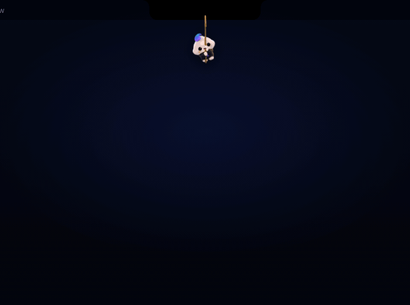
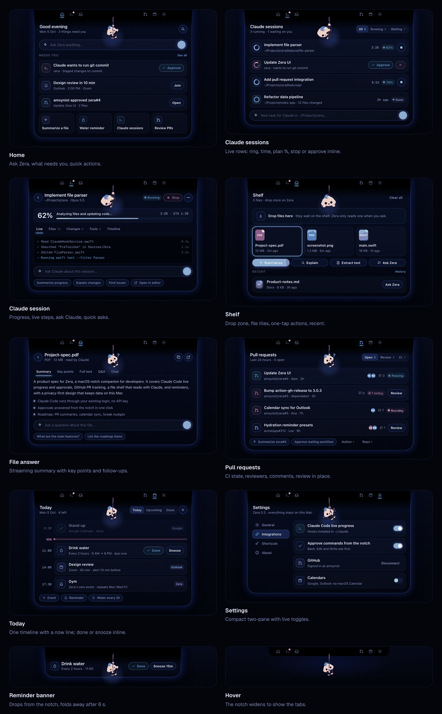
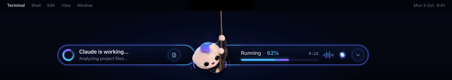
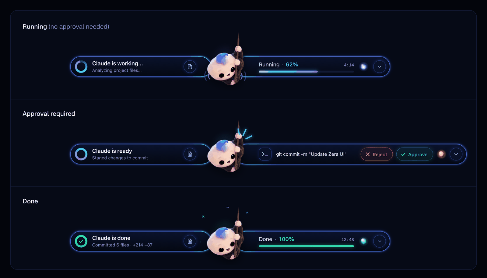

<p align="center"></p>

<h1 align="center">Zera</h1>
<p align="center"><b>Your AI buddy in the notch.</b> A cute, open-source macOS app that lives in your notch and helps with your files, your Claude Code sessions, your pull requests and your day. Works with Claude Code and integrates with GitHub.</p>

<p align="center">
  <a href="https://github.com/amsynist/zera/releases/latest"></a>
  <a href="https://github.com/amsynist/zera/actions/workflows/ci.yml"></a>
  
</p>

<p align="center">
  <a href="#download">Download</a> ·
  <a href="#the-notch-island">Notch island</a> ·
  <a href="#live-wings">Live wings</a> ·
  <a href="#features">Features</a> ·
  <a href="#setup">Setup</a> ·
  <a href="#privacy">Privacy</a> ·
  <a href="#build-from-source">Build</a>
</p>

---

Zera is a fluffy little puff with a blue-violet tuft who hangs from a rope out of your Mac's notch.
Hover her and the notch widens into tabs; click one and that screen grows out of the notch as a
compact island of navy glass. While Claude Code works, she sprouts two glowing wings that show what
it's doing and let you approve its commands right there. **No API key and no account needed:**
Claude runs through your existing Claude Code login, and GitHub uses a token you paste once.

<p align="center">
  <br>
  <sub>Every screen opens out of the notch. Rendered from the design mock-up with sample data.</sub>
</p>

## Download

1. Grab **`Zera-<version>.dmg`** from the [latest release](https://github.com/amsynist/zera/releases/latest).
2. Open it and drag **Zera** into **Applications**.
3. Launch Zera. She appears under the notch (or in the middle of the menu bar on Macs without one).

Requires macOS 13 Ventura or newer, on Apple silicon or Intel.

> **First launch of an unnotarized build:** macOS may say Zera "can't be opened because it is from an
> unidentified developer". Right-click Zera in Applications → **Open** → **Open**. macOS remembers
> after that. Releases built with the signing secrets configured are notarized and open normally.

Each release also has a `.zip` of the app and a `SHA256SUMS.txt`. To check the download, run
`shasum -a 256 -c SHA256SUMS.txt` in the folder with both files.

## The notch island

Every screen lives in one island that grows out of the notch, so Zera never covers your work with a
big window.

- **Tabs at notch level.** Hover Zera and the notch widens to show six tabs on either side of it:
  **Home · Claude · Files** on the left, **PRs · Reminders · Settings** on the right. An amber dot marks
  a tab that needs you.
- **Opens, morphs, folds away.** Click a tab and the island springs open to that screen's size.
  Switching tabs resizes it in place, sliding the new screen in from the side its tab is on. Click
  outside or press <kbd>esc</kbd> and it folds back into the notch. A screen you open from somewhere
  else (a wing's chevron, a notification) waits until your pointer reaches it.
- **Compact.** Screens are 520–660 pt wide and never taller than 470 pt; longer lists scroll inside.
  Details open in place with a back button instead of a second window.
- **One look.** Navy-black glass with a blue neon edge. Every header puts the title on the left, the
  actions on the right and Zera in the middle, hanging from the notch as the island's hinge. A
  selection is always dark navy with a thin blue edge; the blue → violet gradient is kept for the
  main action on a screen.
- **Zera takes a pose for each screen:** waving on Home, hugging the rope for Claude, peeking at your
  files, thinking over PRs and file answers, smiling at Reminders, swinging in Settings.

<p align="center">
  <br>
  <sub>Every screen, held open. Rendered from the design mock-up with sample data.</sub>
</p>

## Live wings

<p align="center">
  <br>
  <sub>Running → approval → done. Rendered from the design mock-up with sample data.</sub>
</p>

While a Claude Code session is active, two glass wings hang off Zera on either side of her rope.

- **Left wing:** what Claude is doing. A ring spins while a tool call is open, with the headline
  (*Claude is working…*, *Claude is ready*, *Claude is done*) and the current step.
- **Right wing:** **Running · 62%** with a progress bar and the session time, and a status orb that
  swirls blue-violet while Claude works, amber while it waits on you and green when it's done.
- **Approvals right on the wing.** When Claude Code would ask you for permission, the right wing
  springs wider to show the command (up to two lines of it) with **Reject** and **Approve**.
- Click a wing or its chevron to open the session; right-click to hide the wings until Claude has
  something new.
- **Zera acts it out.** She hugs her rope, breathes and swings while Claude works; perks up with burst
  lines when a command needs you; hops among sparkles when Claude is done. Hover her for a wiggle, tap
  her for a bounce.

<p align="center"></p>

## Features

### Claude Code: sessions and approvals

Turn on live progress once, and every Claude Code session shows up as it works. This uses Claude
Code's own hooks, with no API key.

- **Sessions:** All / Running / Waiting / Completed and search. Each row shows its status ring, elapsed
  time and plan progress, with **Stop** right on the row (or a button to review a waiting approval).
- **A session**, opened in place: progress with an ETA, a live console of Claude's steps (reading,
  editing, running) with timers, and tabs for **Files**, **Changes**, **Tools** and **Timeline**.
- **Real numbers only.** The percentage appears when Claude keeps a to-do plan; the ETA once some plan
  items are done. Otherwise the bar runs without a number.
- **Stop** asks Claude to halt at its next step: the hook blocks the next tool call, so Claude ends its turn.
- **Ask Claude about this session**, plus **Summarize progress**, **Explain changes**, **Find issues**
  and **Open in editor**. These send a brief of the session (task, timeline, files, `git diff`)
  through your Claude Code login.
- **Approvals** appear only when Claude Code itself would ask, so auto mode, bypass mode and your
  allow rules are respected. Answer on the wing, or in the approval island when the wing has no room.

### Files: a Shelf that reads with Claude

Drop files on Zera or on the Files tab and they wait on your **Shelf**. From there you can drag them
anywhere, into Teams, Slack, Mail or an upload field. Dropping only adds the file to the Shelf;
nothing goes to Claude until you ask.

- **Summarize · Explain · Extract text · Ask Zera.** Pick a file and an action, and its answer opens
  in place with **Summary / Key Points / Full Text / Q&A / Chat** tabs and a follow-up box.
- **Answers stay inside Zera.** Claude runs hidden through your Claude Code login and the answer
  streams in. Terminal never opens.
- **Full Text works locally** for text, code, Markdown and PDFs. Images use Claude.
- **Removing never deletes the file on your Mac.** Take files off the Shelf from the row menu, or
  **Clear all** (with Undo).

### Pull requests

- Covers PRs opened in the **last 24 hours** across your repos (including organisation repos you belong
  to). Checks every 2 minutes.
- **Open · Review (not approved yet) · CI · Approvals (ones you approved)** are filters over that one
  list, with search and **Author / Label / Repo / Sort**.
- Each row shows CI status, reviewer avatars, comment count, **Review** (opens the Files tab) and a
  ••• menu. **PR detail** opens in place, with **Summarize**: Zera hands Claude the description,
  failing checks and a diff excerpt, only when you click it. Mind your organisation's rules before
  sending private code to an AI service.
- Banners when you open a PR, and when someone approves, requests changes or comments on one of
  yours. **Approve** workflow runs that are waiting for you, right from the PR.

### Reminders & Calendar

- **Today · Upcoming · Completed**, with filters for **All · Google · Outlook · Apple · Custom · Reminders**.
  Today is one timeline: calendar events and reminders side by side, each marked with where it really
  comes from (Google / Outlook / Apple through macOS Calendar, Zera's own events, reminders, water).
- **+ Add Event ▾** keeps creating explicit and separate: **Create Event** (type, date, time, duration,
  all-day, repeat incl. custom every N days / weeks on chosen weekdays / months, end date, calendar,
  location, description, alert), **Create Reminder** (once, every day, every 2 / 3 / 4 hours, every week,
  or every N minutes / hours / days / weeks, with **active hours**), and **Hydration Reminder**, a fast
  "Drink water every 30m / 1h / 2h / 3h" preset with a live preview of today's times.
- One recurrence engine drives the list, the details and the scheduler: "every 2 hours, 9 AM → 9 PM"
  fires at 9, 11, 1, 3, 5, 7 and 9, every day.
- A banner drops from the notch when one is due, with **Done** and **Snooze** (15 min · 30 min ·
  1 hour · 2 hours · Tomorrow). States: upcoming, due, overdue, snoozed, done, off.
- Completed items can be **restored** or deleted. Everything survives a restart.
- Events you create are kept by Zera on this Mac, or, if you pick one of your calendars, added to it
  through macOS Calendar. Zera never labels its own events as Google, Outlook or Apple.

### And the rest

| | |
| --- | --- |
| **At the notch** | Hangs on a rope, sways toward your pointer, says hi, dozes off when you're away. Drag her along the top edge. A ripple shows when she's tappable. |
| **Home** | A greeting, **Ask Zera**, up to three things that need you (approvals, reminders, PRs, meetings) and one row of quick actions. |
| **Break nudges** | Optional "time for a break?" every 30 min – 2 hours, only while you're at the keyboard. |
| **Settings** | General · Integrations · Shortcuts · About. Diagnostics for the Claude CLI. Honours Reduce Motion: no sway, no springs. |

## Setup

Everything is in **Settings → Integrations**.

**Claude (file assistant).** Uses your existing Claude Code login by default: install the
[Claude Code CLI](https://docs.claude.com/en/docs/claude-code) and sign in once. Zera finds `claude`
on its own and runs it hidden in print mode with only its `Read` tool. Zera never reads or stores the
CLI's credentials. If you'd rather use an **Anthropic API key**, switch the provider. The key is kept
in your login Keychain, only sent to `api.anthropic.com`, and Zera never falls back to the paid API on its own.

**Claude Sessions (live progress).** Click **Turn on live progress** on the Claude screen, or
**Follow Claude's work** in Settings. This adds small non-blocking hooks to `~/.claude/settings.json`
and leaves the other settings in that file alone (the file is re-saved as formatted JSON). Restart any
open Claude Code session afterwards. **Remove** undoes it. The hooks only pass events to Zera while it
is running; Zera reads each event and deletes it within a second.

**Claude Code approvals.** Settings → Claude → **Install hook** adds one `PermissionRequest` entry.
Claude Code runs it only when it is about to ask you for permission, so auto mode, bypass mode and your
allow rules are respected: Zera only asks when the terminal would have asked. If Zera isn't running or
you don't answer within ten minutes, Claude Code asks in the terminal as usual. Zera's own requests are
marked so they never show up as approvals. Installs from earlier versions (a `PreToolUse` entry) are
moved over the next time Zera starts.

**GitHub.** Paste a **fine-grained** personal access token with read access to Pull requests, Checks
and Actions, for the repositories you want Zera to watch. Give Actions *write* access only if you want
**Approve** for waiting workflow runs. The token is kept in your login **Keychain** and only sent to
`api.github.com`. Zera doesn't ship GitHub's logo; the PR screen uses a generic pull-request glyph.

**Calendar.** Settings → Integrations → **Calendar**, or **Connect** on the Reminders screen. Zera reads
(and, only when you ask, adds) events through macOS Calendar, so Google, Outlook and iCloud accounts
added there all show up.

## Privacy

Zera has no account, no analytics, no telemetry, no crash reporting and no update service.

- Files are referenced, not copied. Dropping a file never sends it anywhere. Pasted images and text are
  kept in `~/Library/Application Support/Zera/Staged` until you remove them from the Shelf.
- File contents go to Claude only when you click Summarize, Explain, Extract or Ask, through your
  own Claude Code login (or your API key, if you chose that).
- Claude's answers about your files are kept in memory only. Document text is never logged.
- Briefs for PR / session questions (which can include a diff of your code) are written to
  `~/Library/Caches/Zera` (readable only by you), sent to Claude only when you ask, and deleted after an
  hour and on every launch.
- Live progress: Claude Code hook events (which can include your prompts and the tools' input and
  output) are handed to Zera and deleted as soon as they're read. Nothing is written while Zera isn't running.
- The Anthropic API key and the GitHub token are kept in your login Keychain.
- Reminders, events and your calendar stay on your Mac (`~/Library/Application Support/Zera`, readable
  only by you) and are never sent to Claude.
- GitHub calls go to `api.github.com` with your token. Avatars load from GitHub's image CDN without it.
- No Accessibility or Input Monitoring permission: the pointer position is polled, with no event tap.
- The only things Zera opens outside itself are **Open Claude** / **New Session**, links you click, and
  "Open With → Zera" from Finder (which only adds the file to the Shelf).

Zera isn't sandboxed: it runs with your user's permissions so it can read files you drop, run your
`claude` CLI and edit `~/.claude/settings.json` when you turn hooks on. See [SECURITY.md](SECURITY.md).

## Build from source

Requirements: macOS 13+, Xcode or the Command Line Tools (`xcode-select --install`).

```bash
git clone https://github.com/amsynist/zera.git
cd zera
./build.sh                 # universal build → dist/Zera.app (ad-hoc signed)
open dist/Zera.app
swift test                 # unit tests
```

`build.sh` compiles with SwiftPM, bundles the sprites, renders the app icon, writes `Info.plist` and
signs the app. It takes the version from `ZERA_VERSION` or the latest git tag. There's no Xcode project
and no dependencies.

> Running a debug build (`swift build && .build/debug/Zera`) next to an installed Zera makes macOS ask
> for Keychain access to the GitHub token, because the two are signed differently. Deny it if you
> don't need GitHub while testing.

### Project layout

| Path | What's there |
| --- | --- |
| `Sources/Zera/ZeraController.swift` | The brain: her window, bubble, the island, the wings, reactions |
| `Sources/Zera/NotchIsland.swift` | The notch island: shape, tabs at notch level, open / morph / close animations |
| `Sources/Zera/ZeraView.swift`, `Sprites.swift`, `Companion.swift` | Zera herself: sprites, rope, sway, moods, per-screen poses, Claude-state animations |
| `Sources/Zera/ActivityPill.swift` | The live wings: ring, progress, status orb, approvals |
| `Sources/Zera/ClaudeSessionsView.swift`, `ClaudeActivityService.swift` | Claude sessions and the activity hook |
| `Sources/Zera/ClaudeHookService.swift` | The Claude Code approvals hook (`PermissionRequest`) |
| `Sources/Zera/DropFilesView.swift`, `ShelfStore.swift` | Files: the Shelf and per-file answers |
| `Sources/Zera/GitHubCard.swift`, `GitHubComponents.swift`, `GitHubService.swift` | Pull requests, shared components, polling |
| `Sources/Zera/ZeraAssistant.swift`, `ClaudeCLI.swift`, `ClaudeProcessManager.swift`, `ClaudeCodeOutputParser.swift` | The in-app Claude file assistant |
| `Sources/Zera/AnthropicAPIClient.swift`, `KeychainStore.swift` | Optional API-key provider |
| `Sources/Zera/RemindersView.swift`, `ReminderForms.swift`, `ReminderComponents.swift`, `ReminderCards.swift` | Reminders & Calendar, the three forms, the banner |
| `Sources/Zera/ReminderModels.swift`, `ReminderService.swift` | Events, reminders, the recurrence engine, scheduler, macOS Calendar |
| `Sources/Zera/Cards.swift`, `ResultCard.swift` | Home, Settings, approvals, banners, file answers |
| `Sources/Zera/Palette.swift`, `Theme.swift` | Design tokens, the selected look and shared controls |
| `Resources/Sprites` | Her poses (60+ cut-outs; AI-assisted artwork, see `Resources/CARD_SPRITE_PROMPT.md`) |
| `docs/` | README images (renders of the design mock-ups) and the privacy and network notes |
| `Tests/ZeraTests` | XCTest suite |
| `.github/workflows`, `scripts/package.sh` | CI and releases |

## Releasing

Releases are automatic. Tag a version and push it:

```bash
git tag v0.3.0
git push origin v0.3.0
```

The **Release** workflow then:

1. Runs the tests.
2. Builds a universal `Zera.app` with version `0.3.0`.
3. Signs and notarizes it, if the secrets below are set.
4. Publishes **`Zera-0.3.0.dmg`**, **`Zera-0.3.0.zip`** and **`SHA256SUMS.txt`** on the
   [Releases page](https://github.com/amsynist/zera/releases), with notes generated from the merged PRs.

You can also run it from **Actions → Release → Run workflow** and type a version. A version with a
hyphen (`0.3.0-beta.1`) is marked as a pre-release. Every push and pull request runs **CI**, which
runs the tests, builds the app and attaches it to the run.

**Signing and notarization (optional).** Without these secrets the release is ad-hoc signed, and
users right-click → Open once. With them it's a Developer ID build that macOS opens without a warning.
Add them under **Settings → Secrets and variables → Actions**:

| Secret | Value |
| --- | --- |
| `MACOS_CERTIFICATE` | Your *Developer ID Application* certificate exported as `.p12`, base64-encoded (`base64 -i cert.p12 \| pbcopy`) |
| `MACOS_CERTIFICATE_PASSWORD` | The `.p12` password |
| `CODESIGN_IDENTITY` | e.g. `Developer ID Application: Your Name (TEAMID)` |
| `APPLE_ID` | The Apple ID email of your developer account |
| `APPLE_TEAM_ID` | Your 10-character team ID |
| `APPLE_APP_PASSWORD` | An [app-specific password](https://support.apple.com/102654) for that Apple ID |

To build a release locally:
`ZERA_VERSION=0.3.0 ./build.sh && ZERA_VERSION=0.3.0 ./scripts/package.sh`.

## Roadmap

- "Always allow" rules for Claude Code approvals from the wing
- Several files at once in the file assistant
- Slack / Jira / Notion notifications
- Homebrew cask

## Contributing

Issues and PRs welcome. Keep her cute, keep it local, and never require an API key.
Please report security issues privately — see [SECURITY.md](SECURITY.md).

## License

A license will be added before the first official release. Until then, no license is granted beyond
viewing the source on GitHub.

## Trademarks

Zera is an independent open-source project. It is not affiliated with, endorsed by, or sponsored by
Anthropic, GitHub, or Apple. Claude and Claude Code are trademarks of Anthropic, PBC. GitHub is a
trademark of GitHub, Inc. Apple, Mac, macOS and Finder are trademarks of Apple Inc. Other names may be
trademarks of their respective owners.
