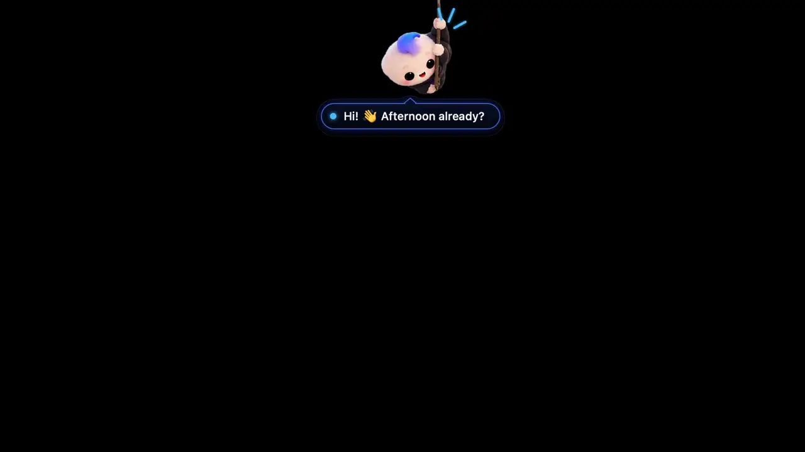

<p align="center"></p>

<h1 align="center">Zera</h1>
<p align="center"><b>Your AI buddy in the notch.</b> A free, open-source macOS app that lives in your notch and helps with your Claude Code sessions, your tasks and timesheets, your files and your day.</p>

<p align="center">
  <a href="https://github.com/amsynist/zera/releases/latest"></a>
  <a href="https://github.com/amsynist/zera/actions/workflows/ci.yml"></a>
  
</p>

<p align="center">
  <a href="docs/zera-tour.mp4"></a><br>
  <sub>Recorded from the app with sample data. <a href="docs/zera-tour.mp4">Watch in full resolution (MP4, 1080p)</a>.</sub>
</p>

## What it does

- **Notch island** — hover Zera and the notch opens into tabs: Home, Claude, Files, Clipboard, Tasks, Pull requests, Reminders, Settings.
- **Claude Code, live** — wings beside the notch show what each session is doing; approve its commands and reply when it's done, without the terminal.
- **Tasks and focus** — projects, a to-do list and a focus orb that times your work. Add with `Write docs #project 30m` or ⌥⌘T from anywhere.
- **Timesheets from commits** — link a project to its repos and your commits become done tasks, grouped by Claude. Click a day to copy it, or export to Excel, CSV or text.
- **Files** — drop files on the notch and ask Claude to summarize, explain or extract.
- **Clipboard history**, **pull requests** (reviews, checks, approvals), **reminders and calendar** with meeting heads-ups.
- **App opener** — ⌥Space brings down a tree of your apps and commands, with ⌘K actions.

No account and no API key: Claude runs through your existing Claude Code login.

## Download

1. Grab **`Zera-<version>.dmg`** from the [latest release](https://github.com/amsynist/zera/releases/latest).
2. Open it and drag **Zera** into **Applications**.
3. Launch Zera. She appears under the notch (or in the middle of the menu bar on Macs without one).

Requires macOS 13 or newer, Apple silicon or Intel. If macOS says an unnotarized build is from an
unidentified developer, right-click Zera → **Open** → **Open** once.

## Setup

Everything is in **Settings → Integrations**:

- **Claude** — install the [Claude Code CLI](https://docs.claude.com/en/docs/claude-code) and sign in once; Zera finds it. An Anthropic API key is optional.
- **Live progress and approvals** — one click adds small hooks to `~/.claude/settings.json`; **Remove** undoes it.
- **GitHub** — paste a fine-grained token with read access to pull requests, checks and actions.
- **Calendar** — connects through macOS Calendar, so Google, Outlook and iCloud accounts all show up.

## Privacy

No account, analytics, telemetry or update service. Everything stays on your Mac; file contents and
commit messages go to Claude only through your own Claude Code login, and only when you ask (or link a
project). Tokens live in your Keychain. Details in [SECURITY.md](SECURITY.md) and
[docs/PRIVACY_DATA_MAP.md](docs/PRIVACY_DATA_MAP.md).

## Build from source

```bash
git clone https://github.com/amsynist/zera.git
cd zera
./build.sh          # → dist/Zera.app
open dist/Zera.app
swift test
```

Needs macOS 13+ and the Xcode Command Line Tools. No Xcode project, no dependencies.

## Contributing

Issues and PRs welcome. Keep her cute, keep it local, and never require an API key. Please report
security issues privately — see [SECURITY.md](SECURITY.md).

## License and trademarks

A license will be added before the first official release; until then no license is granted beyond
viewing the source. Zera is independent and not affiliated with Anthropic, GitHub or Apple. Claude and
Claude Code are trademarks of Anthropic, PBC; GitHub of GitHub, Inc.; Apple, Mac and macOS of Apple Inc.
