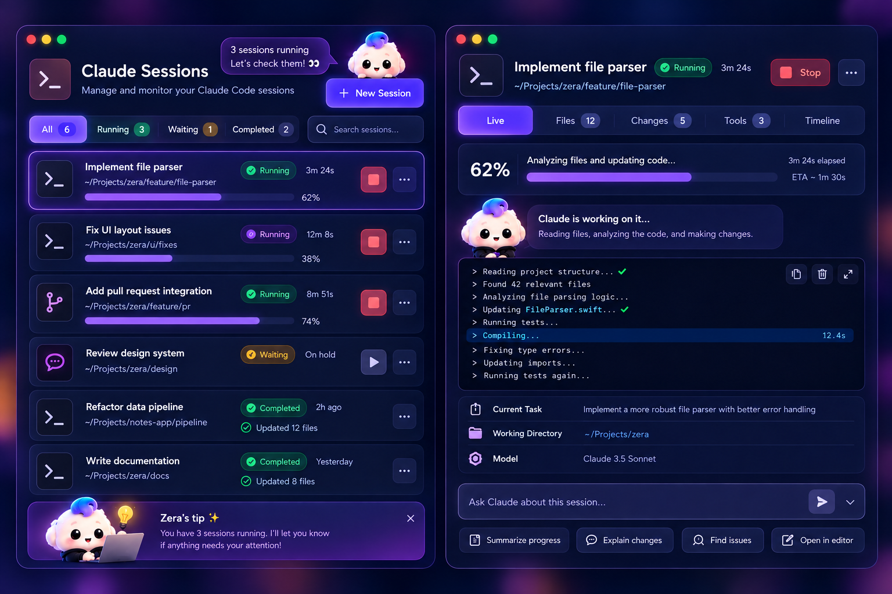
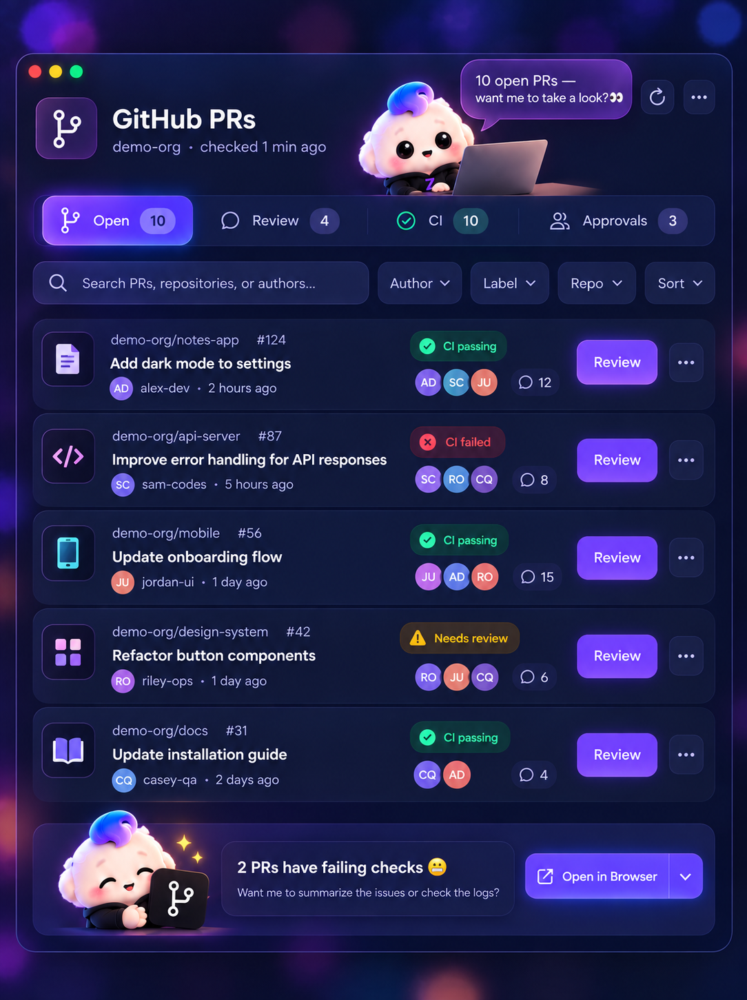

<p align="center">
  
</p>

<h1 align="center">Zera</h1>
<p align="center"><b>Your AI desktop buddy.</b> A cute, open-source macOS companion that lives in your notch and helps with Claude, GitHub, files and your day.</p>

<p align="center">
  <a href="https://github.com/amsynist/zera/releases/latest"></a>
  <a href="https://github.com/amsynist/zera/actions/workflows/ci.yml"></a>
  
  
</p>

<p align="center">
  <a href="#download">Download</a> ·
  <a href="#features">Features</a> ·
  <a href="#setup">Setup</a> ·
  <a href="#privacy">Privacy</a> ·
  <a href="#build-from-source">Build</a> ·
  <a href="#releasing">Releasing</a>
</p>

---

Zera is a fluffy little puff with a blue-violet tuft who hangs from a rope out of your Mac's notch.
She holds files for you and reads them with Claude, follows your Claude Code sessions live, watches
your GitHub PRs, lets you approve Claude Code commands from the desktop, and keeps you on track with
reminders. **No API key and no account needed:** Claude runs through your existing Claude Code login,
and GitHub uses a token you paste once.


## Download

1. Grab **`Zera-<version>.dmg`** from the [latest release](https://github.com/amsynist/zera/releases/latest).
2. Open it and drag **Zera** into **Applications**.
3. Launch Zera. She appears under the notch (or in the middle of the menu bar on Macs without one).

Requires macOS 13 Ventura or newer, on Apple silicon or Intel.

> **First launch of an unnotarized build:** macOS may say Zera "can't be opened because it is from an
> unidentified developer". Right-click Zera in Applications → **Open** → **Open**. macOS remembers
> after that. Releases built with the signing secrets configured are notarized and open normally.

Each release also has a `.zip` of the app and a `SHA256SUMS.txt`. To check the download, run
`shasum -a 256 -c SHA256SUMS.txt` in the folder with both files.

## Features

### Drop Files: a Shelf that reads with Claude

Drop files on Zera or on the Drop Files card and they wait on your **Shelf**. From there you can drag
them anywhere, into Teams, Slack, Mail or an upload field. Dropping only adds the file to the Shelf.
Nothing goes to Claude until you ask.

- **Summarize · Explain · Extract text · Ask Zera.** Click a file or an action and the workspace opens:
  the file with **Summary / Key Points / Full Text / Q&A / Chat** tabs, and the Shelf panel with its **Drop Bin**.
- **Answers stay inside Zera.** Claude runs hidden through your Claude Code login, the answer streams
  in, and follow-up questions keep the file in context. Terminal never opens.
- **Full Text works locally** for text, code, Markdown and PDFs. Images use Claude.
- **Drop Bin.** Drag a file there, or use the row menu, to take it off the Shelf. Clear all comes with
  Undo. **Removing never deletes the file on your Mac.**
- **Recent files** keeps your history after a file leaves the Shelf, with a one-click suggested action.

### Claude Sessions: follow Claude Code live

<p align="center">
  
</p>

Turn on live progress once, and every Claude Code session shows up as it works. This uses Claude
Code's own hooks, with no API key.

- **Sessions list:** All / Running / Waiting / Completed, search, status, elapsed time and progress.
- **Live view:** a progress card, Zera's take on what's happening, and a console of Claude's steps
  (reading, editing, running) with live timers. Also tabs for **Files**, **Changes**, **Tools** and **Timeline**.
- **Real numbers only.** The percentage appears when Claude keeps a to-do plan. The ETA appears once
  some plan items are done. Otherwise the bar runs without a number.
- **Stop** asks Claude to halt at its next step: the hook blocks the next tool call, so Claude ends its turn.
- **Ask Claude about this session**, plus **Summarize progress**, **Explain changes**, **Find issues** and
  **Open in editor**. These send a brief of the session (task, timeline, files, `git diff`) through your
  Claude Code login.
- A compact **live bar** under Zera shows the current step at a glance. Click it to expand.

### GitHub PRs

<p align="center">
  
</p>

- Covers PRs opened in the **last 24 hours** across your repos. Checks every 2 minutes, in real time.
- **Open · Review (not approved yet) · CI · Approvals (ones you approved)** are filters over that one list.
- Search, **Author / Label / Repo / Sort** filters. Each row shows CI status, reviewer avatars,
  comment count, **Review** (opens the Files tab) and a ••• menu.
- **PR detail** inside the card, with **Summarize**: Zera hands Claude the description, failing checks
  and a diff excerpt.
- Notifications when you open a PR, and when someone approves, requests changes or comments on one
  of yours. **Approve** workflow runs that are waiting for you, right from the PR.

### And the rest

| | |
| --- | --- |
| **At the notch** | Hangs on a rope, sways toward your pointer, says hi, dozes off when you're away. Drag her along the top edge. A radar ripple shows when she's tappable. |
| **Hover pill** | Shelf · Home · Claude · Reminders · GitHub · Settings. Tap Zera to open your default card, tap again to tuck it away. |
| **Home** | Greeting, "Ask Zera…", **Needs attention** (approvals, reminders, PRs, meetings), Recent, Quick Actions. |
| **Claude Code approvals** | When Claude Code wants to run a command, an approval card drops down with **Approve / Reject**. Claude Code gets the answer. |
| **Reminders** | Today / Upcoming / Completed. One-offs, daily or weekdays, or "every 2 hours". Meeting warnings from Calendar, break nudges, Snooze / Done. |
| **Settings** | General · Appearance (Light / Dark / System) · Integrations · Shortcuts · About. Diagnostics for the Claude CLI. Honours Reduce Motion. |

## Setup

Everything is in **Settings → Integrations**.

**Claude (file assistant).** Uses your existing Claude Code login by default: install the
[Claude Code CLI](https://docs.claude.com/en/docs/claude-code) and sign in once. Zera finds `claude`
on its own and runs it hidden in print mode with only its `Read` tool. Zera never reads or stores the
CLI's credentials. If you'd rather use an **Anthropic API key**, switch the provider. The key is kept
in your login Keychain, only sent to `api.anthropic.com`, and Zera never falls back to the paid API on its own.

**Claude Sessions (live progress).** Click **Turn on live progress** on the Claude screen, or
**Follow Claude's work** in Settings. This adds small non-blocking hooks to `~/.claude/settings.json`
and leaves everything else in that file alone. Restart any open Claude Code session afterwards.
**Remove** undoes it.

**Claude Code approvals.** Settings → Claude → **Install hook** adds one `PreToolUse` entry (matcher
`Bash`). If Zera isn't running or you don't answer within ten minutes, Claude Code asks in the terminal
as usual. Zera's own requests are marked so they never show up as approvals.

**GitHub.** Paste a personal access token. For a classic token, use `repo` + `workflow` scopes. For a
fine-grained token, use Pull requests, Checks and Actions (Actions write if you want **Approve**).
The token is stored in `~/Library/Application Support/Zera/github.token` (mode 600) and only sent to
`api.github.com`. Want GitHub's mark on the tiles? Save it from
[github.com/logos](https://github.com/logos) as `Resources/github-mark.png` before building.

**Calendar.** Settings → Reminders → **Connect Calendar** for meeting warnings.

## Privacy

- Files are referenced, not copied. Dropping a file never sends it anywhere.
- File contents go to Claude only when you click Summarize, Explain, Extract or Ask, through your
  own Claude Code login (or your API key, if you chose that).
- Claude's answers about your files are kept in memory only. Document text is never logged.
- Briefs for PR / session questions are written to `~/Library/Caches/Zera` (mode 600).
- GitHub calls go to `api.github.com` with your token. Avatars load from GitHub's image CDN without it.
- No Accessibility or Input Monitoring permission: the pointer position is polled, with no event tap.
- The only things Zera opens outside itself are **Open Claude** / **New Session**, and only when you click them.

## Build from source

Requirements: macOS 13+, Xcode or the Command Line Tools (`xcode-select --install`).

```bash
git clone https://github.com/amsynist/zera.git
cd zera
./build.sh                 # universal build → dist/Zera.app (ad-hoc signed)
open dist/Zera.app
swift test                 # unit tests
```

`build.sh` compiles with SwiftPM, bundles the sprites, renders the app icon, writes `Info.plist` and
signs the app. It takes the version from `ZERA_VERSION` or the latest git tag. There's no Xcode project
and no dependencies.

### Project layout

| Path | What's there |
| --- | --- |
| `Sources/Zera/ZeraController.swift` | The brain: her window, bubble, hover pill, cards, reactions |
| `Sources/Zera/ZeraView.swift`, `Sprites.swift`, `Companion.swift` | Zera herself: sprites, rope, sway, moods, in-card poses |
| `Sources/Zera/DropFilesView.swift`, `ShelfStore.swift` | Drop Files, the Shelf, Recent, Drop Bin, per-file results |
| `Sources/Zera/ClaudeSessionsView.swift`, `ClaudeActivityService.swift`, `ActivityPill.swift` | Claude Sessions, the activity hook, the live bar |
| `Sources/Zera/GitHubCard.swift`, `GitHubComponents.swift`, `GitHubService.swift` | GitHub PRs screen, shared components, polling |
| `Sources/Zera/ZeraAssistant.swift`, `ClaudeCLI.swift`, `ClaudeProcessManager.swift`, `ClaudeCodeOutputParser.swift` | The in-app Claude file assistant |
| `Sources/Zera/AnthropicAPIClient.swift`, `KeychainStore.swift` | Optional API-key provider |
| `Sources/Zera/ClaudeHookService.swift` | Claude Code approvals hook |
| `Sources/Zera/Cards.swift`, `ResultCard.swift`, `ReminderCards.swift` | Home, Settings, approvals, toasts, results, reminders |
| `Sources/Zera/Palette.swift`, `Theme.swift` | Design tokens and shared controls |
| `Resources/Sprites` | Her poses (60+ cut-outs) |
| `Tests/ZeraTests` | XCTest suite |
| `.github/workflows`, `scripts/package.sh` | CI and releases |

## Releasing

Releases are automatic. Tag a version and push it:

```bash
git tag v0.3.0
git push origin v0.3.0
```

The **Release** workflow then:

1. Runs the tests.
2. Builds a universal `Zera.app` with version `0.3.0`.
3. Signs and notarizes it, if the secrets below are set.
4. Publishes **`Zera-0.3.0.dmg`**, **`Zera-0.3.0.zip`** and **`SHA256SUMS.txt`** on the
   [Releases page](https://github.com/amsynist/zera/releases), with notes generated from the merged PRs.

You can also run it from **Actions → Release → Run workflow** and type a version. A version with a
hyphen (`0.3.0-beta.1`) is marked as a pre-release. Every push and pull request runs **CI**, which
runs the tests, builds the app and attaches it to the run.

**Signing and notarization (optional).** Without these secrets the release is ad-hoc signed, and
users right-click → Open once. With them it's a Developer ID build that macOS opens without a warning.
Add them under **Settings → Secrets and variables → Actions**:

| Secret | Value |
| --- | --- |
| `MACOS_CERTIFICATE` | Your *Developer ID Application* certificate exported as `.p12`, base64-encoded (`base64 -i cert.p12 \| pbcopy`) |
| `MACOS_CERTIFICATE_PASSWORD` | The `.p12` password |
| `CODESIGN_IDENTITY` | e.g. `Developer ID Application: Your Name (TEAMID)` |
| `APPLE_ID` | The Apple ID email of your developer account |
| `APPLE_TEAM_ID` | Your 10-character team ID |
| `APPLE_APP_PASSWORD` | An [app-specific password](https://support.apple.com/102654) for that Apple ID |

To build a release locally:
`ZERA_VERSION=0.3.0 ./build.sh && ZERA_VERSION=0.3.0 ./scripts/package.sh`.

## Roadmap

- "Always allow" rules for Claude Code approvals; routing file edits through Zera
- Several files at once in the file assistant
- Slack / Jira / Notion notifications
- Homebrew cask

## Contributing

Issues and PRs welcome. Keep her cute, keep it local, and never require an API key.

## License

MIT
